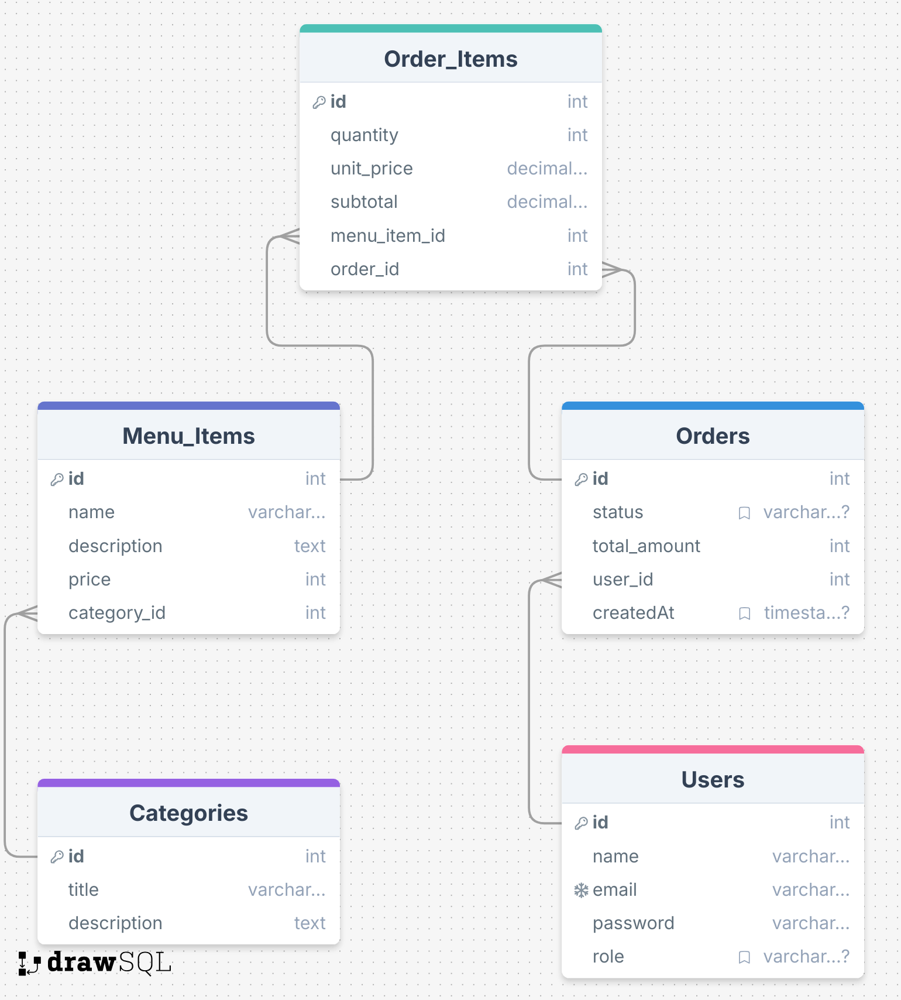

# Restaurant Management System API

A robust REST API for managing restaurant operations including menu management, order processing, and user authentication.

## 🚀 Live Demo
[Live API Link](https://documenter.getpostman.com/view/37843029/2sAYHzFi7M)

## 📝 API Documentation
[Swagger Documentation](https://restaurantmanagementsystem-production-1fe0.up.railway.app/api-docs/)
[Postman Documentation](https://documenter.getpostman.com/view/37843029/2sAYHzFi7M)

### Deployment Features
- Continuous Deployment from GitHub
- Automatic HTTPS/SSL
- Environment Variable Management
- Built-in Monitoring
- Zero-downtime Deployments

## 🌐 Deployment Stack
- Database: Aiven Cloud PostgreSQL
- Server: Railway Platform
- Node.js Runtime
- Automatic SSL Certificate

## Schema Diagram

## ✨ Features

### Menu Management
- Complete CRUD operations for menu items
- Category-based filtering
- Price-based sorting (ASC/DESC)
- Menu item details include name, description, price, and category

### Order Management
- Create and manage orders
- Add/remove items from pending orders
- Order status tracking
- Automatic order expiration after 4 hours
- Export order data (CSV/XLSX)
- Analytics reporting for specific time periods

### 🔄 Automated Order Management
The system implements automated order status management using Cron Jobs:

### Order Expiration Automation
- Automatically checks pending orders every minute
- Updates order status from 'pending' to 'expired' after 4 hours
- Runs in the background without manual intervention
- Ensures efficient order queue management

### User Management
- Role-based authentication (Admin/Staff)
- Secure password reset functionality
- Account recovery process

### Analytics & Reporting
- Top 10 selling items (30-day period)
- Order analytics and reporting
- Data export capabilities

### Security & Performance
- Rate limiting implementation
- JWT-based authentication
- Role-based access control

## 🛠️ Technical Stack

- Node.js
- Express.js
- Sequelize ORM
- PostgreSQL
- JWT Authentication
- Swagger/OpenAPI
- Express Rate Limit
